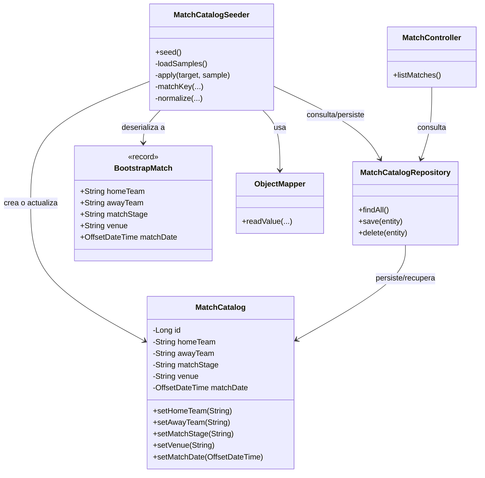
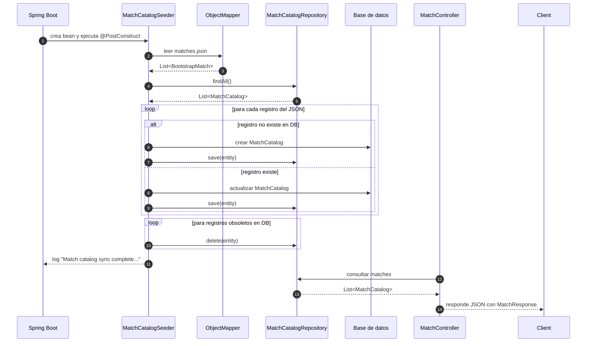

# Análisis Arquitectónico Exhaustivo - World Cup Predictor Backend

**Documento generado:** 2026-07-14  
**Versión del proyecto:** 0.1.0  
**Java:** 21  
**Spring Boot:** 3.2.2  
**Base de datos:** H2 (desarrollo) / PostgreSQL (producción)

---

## SECCIÓN 0: FLUJO DE CARGA DE DATOS EN MATCHES.JSON

### 📋 Componentes Principales del Flujo de Bootstrap

1. **Archivo fuente**: `src/main/resources/bootstrap/matches.json`
   - Contiene array JSON con datos de partidos (homeTeam, awayTeam, matchStage, venue, matchDate)
   
2. **Entidad JPA**: `MatchCatalog`
   - Tabla: `matches_catalog`
   - Campos: id, homeTeam, awayTeam, matchStage, venue, matchDate
   
3. **Seeder Component**: `MatchCatalogSeeder`
   - Se ejecuta en el arranque (@PostConstruct)
   - Lee matches.json y sincroniza con DB
   
4. **Repositorio**: `MatchCatalogRepository`
   - Persiste/recupera datos
   
5. **Endpoint**: `GET /api/matches`
   - Expone datos al frontend (requiere autenticación)
   - MatchController serializa a MatchResponse

### 🔄 Flujo de Ejecución en Startup (Nombre del Flujo: "Sincronización de Catálogo de Partidos")

```
Secuencia temporal:
1. Spring inicia MatchCatalogSeeder (@Component)
2. @PostConstruct llama a seed()
3. Carga matches.json usando ClassPathResource + ObjectMapper
4. Mapea a List<BootstrapMatch> (record)
5. Lee matches existentes en DB (findAll)
6. Crea mapa con clave: normalizada(homeTeam|awayTeam|matchStage|venue|matchDate)
7. Por cada sample en matches.json:
   - Si existe: ACTUALIZA
   - Si no existe: INSERTA
8. Elimina matches en DB que no están en JSON
9. Log: inserted=X, updated=Y, removed=Z
```

### 🔧 Lógica de Sincronización (Nombre del Patrón: "Upsert con Sincronización Completa")

- Usa normalización (trim + lowercase) para comparar
- Clave única compuesta (no por ID)
- Operación CRUD completa (upsert + delete removidos)
- Resultado idempotente: se puede ejecutar múltiples veces sin efectos secundarios

### 📊 Ejemplo de Sincronización Completa

```
Estado inicial (DB):
  Partido A: Mexico vs South Africa (Group A)
  Partido B: USA vs Paraguay (Group D)
  Partido C: Argentina vs Marruecos (Group C)  ← No está en JSON

Estado nuevo (matches.json):
  Partido A: Mexico vs South Africa (Group A)  ← Igual, ACTUALIZAR
  Partido B: USA vs Paraguay (Group D)         ← Igual, ACTUALIZAR
  Partido D: Brazil vs Honduras (Group C)      ← Nuevo, INSERTAR

Resultado log:
"Match catalog sync complete: inserted=1, updated=2, removed=1, totalSamples=3"
```

### 🧩 Explicación de diseño: clases y secuencia

La sección 0 describe un flujo de bootstrap en el que:

1. El archivo `src/main/resources/bootstrap/matches.json` actúa como fuente inicial de datos.
2. Al arrancar la aplicación, el componente `MatchCatalogSeeder` lee ese JSON.
3. Cada registro se convierte en una entidad JPA de tipo `MatchCatalog`.
4. El seeder compara los datos del JSON con los ya existentes en la base de datos y realiza:
   - insert si no existe,
   - update si existe,
   - delete si ya no aparece en el JSON.
5. Posteriormente, el endpoint `GET /api/matches` consulta esos datos para exponerlos al frontend.

En otras palabras, este flujo convierte un archivo estático en datos persistidos y luego los sirve a través de la API.

### 🧱 Diagrama de clases

> Para visualizar este diagrama en la vista previa de Markdown de VS Code, abra la vista previa (Ctrl+Shift+V) y asegúrese de tener habilitado el soporte de Mermaid, por ejemplo con la extensión Markdown Preview Mermaid Support o Markdown Preview Enhanced. Si el renderizado nativo no está disponible, también puede abrirlo en [Mermaid Live](https://mermaid.live/edit).



### 🔄 Diagrama de secuencia

> Para visualizar este diagrama automáticamente en la vista previa de Markdown de VS Code, abra la vista previa (Ctrl+Shift+V) y asegúrese de tener habilitado el soporte de Mermaid, por ejemplo con la extensión Markdown Preview Mermaid Support o Markdown Preview Enhanced. Si el renderizado nativo no está disponible, también puede abrirlo en [Mermaid Live](https://mermaid.live/edit).



---

## 1. MAPEO DE PACKAGES, CLASES Y COMPONENTES PRINCIPALES

### 1.1 Estructura de Packages

```
com.example.worldcuppredictor/
├── api/                                    # Capa de presentación
│   ├── controller/                        # Controladores REST
│   │   ├── AuthController                 # Endpoints de autenticación OAuth2
│   │   ├── MatchController                # Endpoints para catálogo de partidos
│   │   ├── PredictionController           # Endpoints para predicciones
│   │   ├── HealthController               # Endpoint de health check
│   │   └── TeamController                 # Endpoints para equipos
│   └── dto/                               # Data Transfer Objects
│       ├── request/
│       │   └── PredictionRequest          # Validación de entrada para predicciones
│       └── response/
│           ├── PredictionDto              # DTO de salida para predicciones
│           ├── MatchResponse              # DTO para partidos
│           └── ExternalAiRawResponse      # Wrapper para respuestas de AI
│
├── domain/                                 # Capa de dominio
│   ├── entity/                            # Entidades JPA
│   │   ├── User                           # Usuario autenticado
│   │   ├── Prediction                     # Predicción de partido
│   │   ├── MatchCatalog                   # Catálogo de partidos
│   │   ├── TeamStats                      # Estadísticas de equipos
│   │   ├── Role                           # Enum: USER, ADMIN
│   │   └── ResultType                     # Enum: HOME_WIN, AWAY_WIN, DRAW
│   ├── repository/                        # Acceso a datos
│   │   ├── UserRepository                 # JPA repository para usuarios
│   │   ├── PredictionRepository           # JPA repository para predicciones
│   │   ├── MatchCatalogRepository         # JPA repository para catálogo
│   │   └── TeamStatsRepository            # JPA repository para equipos
│   └── service/                           # Lógica de negocio
│       └── PredictionService              # Servicio principal de predicciones
│
└── infrastructure/                         # Capa de infraestructura
    ├── security/                          # Configuración de seguridad
    │   ├── SecurityConfig                 # Configuración de Spring Security
    │   ├── CustomOidcUserService          # Servicio OIDC personalizado
    │   ├── CorsConfig                     # Configuración CORS
    │   ├── AuthService                    # Servicios de autenticación
    │   ├── AuthRedirectSuccessHandler     # Handler de login exitoso
    │   ├── AuthRedirectService            # Gestión de redirecciones
    │   ├── ApiAuthenticationEntryPoint    # Punto de entrada de autenticación
    │   └── ApiAccessDeniedHandler         # Handler de acceso denegado
    ├── exception/                         # Manejo centralizado de excepciones
    │   ├── GlobalExceptionHandler         # @RestControllerAdvice
    │   ├── ApiErrorResponse               # Envoltura de errores API
    │   ├── ErrorBody                      # Cuerpo del error
    │   ├── ErrorCode                      # Enum de códigos de error
    │   ├── ApiErrorFactory                # Factory para respuestas de error
    │   └── ServiceUnavailableException    # Excepción para servicios no disponibles
    ├── ai/                                # Integración con proveedores IA
    │   ├── AiPredictionClient             # Interfaz (Port)
    │   ├── OpenAiPredictionClient         # Implementación para OpenAI
    │   ├── PredictionPromptBuilder        # Construcción de prompts
    │   ├── PredictionResponseParser       # Parsing de respuestas IA
    │   └── AiRateLimitException           # Excepción para rate limit
    ├── bootstrap/                         # Inicialización de datos
    │   ├── DataSeeder                     # Seeding de TeamStats
    │   ├── MatchCatalogSeeder             # Seeding de MatchCatalog desde JSON
    │   └── DotenvEnvironmentPostProcessor # Carga de variables .env
    └── openapi/                           # Documentación OpenAPI
        └── matches-api.yaml               # Especificación de API

```

### 1.2 Componentes Principales

| Componente | Tipo | Responsabilidad |
|-----------|------|-----------------|
| **SecurityConfig** | Bean | Configuración de Spring Security, OAuth2, CSRF, CORS |
| **CustomOidcUserService** | Service | Upsert de usuarios en login OAuth2 |
| **PredictionService** | Service | Orquestación del flujo completo de predicciones |
| **AiPredictionClient** | Interface | Port para integración con proveedores IA |
| **OpenAiPredictionClient** | Service | Adapter a OpenAI REST API |
| **GlobalExceptionHandler** | @RestControllerAdvice | Manejo centralizado de excepciones |
| **DataSeeder** | Component | Inicialización de datos en @PostConstruct |
| **MatchCatalogSeeder** | Component | Carga de catálogo de partidos desde JSON |

---

## 2. FLUJOS DE NEGOCIO PRINCIPALES CON NOMBRES IDENTIFICADOS

### 2.1 FLUJO #1: Autenticación OAuth2 Google (Nombre: "OAuth2-Google-Login-Flow")

```
┌─ User ─┐
    │
    ├─→ GET /api/auth/login?redirectUrl=...
    │       ↓
    │   AuthController.login()
    │       ↓
    │   authRedirectService.storeRedirectInSession()
    │       ↓
    │   response.sendRedirect("/oauth2/authorization/google")
    │       ↓
    ├─→ Google OAuth2 Flow
    │       ↓
    ├─→ Google Callback: /login/oauth2/code/google
    │       ↓
    │   Spring OAuth2AutoConfiguration
    │       ↓
    │   CustomOidcUserService.loadUser()
    │       ├─→ Valida OIDC token
    │       ├─→ Busca User por googleSubject
    │       ├─→ Si existe: actualiza perfil y lastLoginAt
    │       └─→ Si no existe: crea nuevo User (role=USER)
    │       ↓
    │   AuthRedirectSuccessHandler.onAuthenticationSuccess()
    │       ↓
    │   authRedirectService.consumeRedirectFromSession()
    │       ↓
    └─→ response.sendRedirect(storedTarget)
            ↓
        Cliente redirigido a frontend con JSESSIONID en cookie
```

**Puntos clave:**
- Las variables de redirección se almacenan en la sesión HTTP
- El googleSubject es la clave única primaria de lookup
- El email es único pero puede cambiar, así que no se usa como lookup principal
- La sesión HTTP se persiste en cookies con flags: HttpOnly, Secure, SameSite=None

### 2.2 FLUJO #2: Predicción End-to-End (Nombre: "PredictionGeneration-End2End-Flow")

```
┌─ Authenticated User ─┐
    │
    ├─→ POST /api/predictions
    │   Body: { "homeTeam": "France", "awayTeam": "Brazil", ... }
    │       ↓
    │   PredictionController.create()
    │       ├─→ Valida @AuthenticationPrincipal OidcUser
    │       ├─→ Busca User por googleSubject
    │       └─→ Llama PredictionService.createPrediction()
    │           ↓
    │       PredictionService.createPrediction()
    │           ├─→ Validación de request
    │           │   ├─ homeTeam no vacío
    │           │   ├─ awayTeam no vacío
    │           │   ├─ teams diferentes
    │           │   └─ date ISO-8601 si se proporciona
    │           │
    │           ├─→ Carga todas las TeamStats
    │           │
    │           ├─→ PredictionPromptBuilder.build()
    │           │   ├─ Extrae stats para home y away teams
    │           │   ├─ Construye prompt con instrucciones y features
    │           │   └─ Retorna string con prompt estructurado
    │           │
    │           ├─→ OpenAiPredictionClient.predict(prompt)
    │           │   ├─ POST https://api.openai.com/v1/responses
    │           │   ├─ Header: Authorization: Bearer ${OPENAI_API_KEY}
    │           │   ├─ Body: { "model": "gpt-4o-mini", "input": prompt }
    │           │   └─ Maneja HTTP 429 como AiRateLimitException
    │           │
    │           ├─→ PredictionResponseParser.parse(raw)
    │           │   ├─ Intenta parsing JSON directo
    │           │   ├─ Busca payload en envelopes conocidos
    │           │   ├─ Busca recursivamente en string nodes
    │           │   ├─ Extrae: predictedHomeGoals, predictedAwayGoals, result, confidence, explanation
    │           │   └─ Mapea result string a enum ResultType
    │           │
    │           ├─→ Trunca explanation si excede 255 caracteres (legacy schema)
    │           │
    │           ├─→ Crea entidad Prediction
    │           │   ├─ Vincula a User
    │           │   ├─ Almacena contexto del partido
    │           │   ├─ Almacena resultado de IA
    │           │   ├─ Almacena raw response JSON
    │           │   └─ Asigna requestedAt = now
    │           │
    │           ├─→ PredictionRepository.save(prediction)
    │           │
    │           └─→ Retorna PredictionDto con metadatos
    │       ↓
    │   GlobalExceptionHandler intercepta excepciones
    │       ├─ AiRateLimitException → HTTP 429
    │       ├─ ServiceUnavailableException → HTTP 503
    │       └─ Exception → HTTP 500 con ApiErrorResponse
    │       ↓
    └─→ HTTP 200 con PredictionDto
```

**Tiempos y características:**
- Validación en @Valid PredictionRequest (constraint violations)
- Rate limiting delegado a OpenAI (429 triggering AiRateLimitException)
- Parser resiliente a múltiples formatos de respuesta IA
- Explicación truncada para compatibilidad con esquema legacy

### 2.3 FLUJO #3: Logout (Nombre: "Session-Invalidation-Logout-Flow")

```
┌─ Authenticated User ─┐
    │
    ├─→ POST /api/auth/logout (o GET /api/auth/logout)
    │       ↓
    │   AuthController.logout()
    │       │
    │       ├─→ AuthService.logout()
    │       │   ├─ HttpSession.invalidate()
    │       │   ├─ SecurityContextHolder.clearContext()
    │       │   ├─ Expira cookies: JSESSIONID, SESSION
    │       │   │  (Set-Cookie con max-age=0, Secure, HttpOnly, SameSite=None)
    │       │   └─ Loguea: auth.logout user=email hadSession=true
    │       │
    │       └─→ HTTP 200 { "success": true, "message": "Logged out successfully" }
```

### 2.4 FLUJO #4: Inicialización de Datos (Nombre: "Bootstrap-Data-Synchronization-Flow")

```
┌─ Aplicación Inicia ─┐
    │
    ├─→ DotenvEnvironmentPostProcessor
    │   ├─ Lee .env si existe
    │   └─ Carga variables de entorno
    │
    ├─→ DataSeeder @PostConstruct (Flujo: "TeamStats-Sync-Flow")
    │   ├─ Carga 30+ equipos de World Cup 2026
    │   ├─ Compara con BD existente
    │   ├─ Inserta, actualiza o elimina según sea necesario
    │   └─ Loguea: TeamStats sync complete: inserted=X, updated=Y, removed=Z
    │
    ├─→ MatchCatalogSeeder @PostConstruct (Flujo: "MatchCatalog-Sync-Flow")
    │   ├─ Lee bootstrap/matches.json
    │   ├─ Parsea con Jackson
    │   ├─ Sincroniza con BD usando matchKey (home|away|stage|venue|date)
    │   └─ Loguea: Match catalog sync complete
    │
    └─→ Aplicación lista para recibir requests
```

---

## 3. ARQUITECTURA EN CAPAS Y PATRONES UTILIZADOS

### 3.1 Arquitectura Estratificada (Layered Architecture)

```
┌──────────────────────────────────────┐
│  API Layer (REST Controllers)        │  ← Entrada
├──────────────────────────────────────┤
│  Application Layer (DTOs, Validation)│  ← Transformación
├──────────────────────────────────────┤
│  Business Logic Layer (Services)     │  ← Orquestación
├──────────────────────────────────────┤
│  Domain Layer (Entities, Repositories)  ← Modelos de negocio
├──────────────────────────────────────┤
│  Infrastructure Layer                │  ← Técnico
│  ├─ Security (Spring Security)       │
│  ├─ Exception Handling               │
│  ├─ AI Integration (Ports & Adapters)│
│  ├─ Bootstrap/Data Initialization    │
│  └─ OpenAPI/Documentation            │
├──────────────────────────────────────┤
│  Persistence Layer (JPA/ORM)         │  ← Datos
├──────────────────────────────────────┤
│  External Services (OpenAI API)      │  ← Externos
└──────────────────────────────────────┘
```

### 3.2 Patrones Implementados

| Patrón | Ubicación | Descripción |
|--------|-----------|-------------|
| **Repository Pattern** | domain/repository | Abstracción de acceso a datos con Spring Data JPA |
| **Service Layer** | domain/service | Lógica de negocio centralizada |
| **DTO Pattern** | api/dto | Transformación de data entre capas |
| **Ports & Adapters (Hexagonal)** | infrastructure/ai | `AiPredictionClient` interface + `OpenAiPredictionClient` impl |
| **Factory Pattern** | infrastructure/exception | `ApiErrorFactory` para construcción de errores |
| **Strategy Pattern** | infrastructure/ai | Intercambiabilidad de proveedores IA |
| **Observer Pattern** | infrastructure/bootstrap | `@PostConstruct` para inicialización |
| **Handler Pattern** | infrastructure/security | `AuthRedirectSuccessHandler`, `AuthenticationEntryPoint` |
| **Decorator Pattern** | infrastructure/exception | `@RestControllerAdvice` para wrapping de excepciones |

### 3.3 Principios SOLID

| Principio | Aplicación |
|-----------|-----------|
| **S**ingle Responsibility | Cada clase tiene una única razón para cambiar (Controllers, Services, Repositories) |
| **O**pen/Closed | `AiPredictionClient` abierto a nuevas implementaciones sin modificar existentes |
| **L**iskov Substitution | Nuevos repositorios pueden reemplazar `JpaRepository` sin romper contrato |
| **I**nterface Segregation | `AiPredictionClient` expone solo el método `predict()` necesario |
| **D**ependency Inversion | Inyección de dependencias via constructores; desacoplamiento de Spring |

---

## 4. DEPENDENCIAS Y RELACIONES ENTRE COMPONENTES

### 4.1 Grafo de Dependencias Principal

```
PredictionController
    ├─→ PredictionService
    │   ├─→ PredictionRepository (JPA)
    │   ├─→ TeamStatsRepository (JPA)
    │   ├─→ AiPredictionClient (interface)
    │   │   └─→ OpenAiPredictionClient (@Primary)
    │   │       ├─→ WebClient (Spring Webflux)
    │   │       └─→ @Value properties
    │   ├─→ PredictionPromptBuilder (static utility)
    │   └─→ PredictionResponseParser (static utility)
    ├─→ UserRepository (JPA)
    └─→ GlobalExceptionHandler
        └─→ ApiErrorFactory

AuthController
    ├─→ UserRepository (JPA)
    ├─→ AuthRedirectService
    └─→ AuthService

MatchController
    └─→ MatchCatalogRepository (JPA)

TeamController
    └─→ TeamStatsRepository (JPA)

SecurityConfig
    ├─→ CustomOidcUserService
    │   └─→ UserRepository (JPA)
    ├─→ AuthRedirectSuccessHandler
    │   └─→ AuthRedirectService
    ├─→ ApiAuthenticationEntryPoint
    │   └─→ ApiErrorFactory
    └─→ ApiAccessDeniedHandler
        └─→ ApiErrorFactory
```

### 4.2 Relaciones de Entidades JPA

```
User (1) ──←── (N) Prediction
    │
    ├─ id (PK)
    ├─ googleSubject (UNIQUE) ← OIDC claim
    ├─ email (UNIQUE)
    ├─ role: Role (USER | ADMIN)
    ├─ createdAt
    └─ lastLoginAt

Prediction (N) ──→ (1) User
    │
    ├─ id (PK)
    ├─ user_id (FK) → User
    ├─ homeTeam
    ├─ awayTeam
    ├─ matchStage
    ├─ venue
    ├─ matchDate (nullable)
    ├─ predictedHomeGoals
    ├─ predictedAwayGoals
    ├─ result: ResultType (HOME_WIN | AWAY_WIN | DRAW)
    ├─ confidenceScore
    ├─ explanation (TEXT)
    ├─ rawProviderResponseJson (TEXT)
    └─ requestedAt

MatchCatalog (standalone)
    ├─ id (PK)
    ├─ homeTeam
    ├─ awayTeam
    ├─ matchStage
    ├─ venue
    └─ matchDate

TeamStats (standalone)
    ├─ id (PK)
    ├─ teamName (UNIQUE)
    ├─ fifaCode (UNIQUE)
    ├─ confederation
    ├─ fifaRanking
    ├─ fifaPoints
    ├─ avgGoalsFor
    ├─ avgGoalsAgainst
    ├─ attackScore [0-1]
    ├─ defenseScore [0-1]
    ├─ squadStrengthScore [0-1]
    └─ ... (otros scores)
```

---

## 5. DECISIONES ARQUITECTÓNICAS IMPORTANTES

### 5.1 Spring Security + OAuth2 (Google OIDC)

**Decisión:** Usar Spring Security 6.x con OAuth2Client y OIDC para Google.

**Razones:**
- Autenticación stateful con sesiones HTTP (JSESSIONID)
- No requiere JWT ni tokens custom
- Google maneja la seguridad del oauth flow
- Integración nativa con Spring Security

**Trade-offs:**
- Bound a cookies HTTP (no ideal para SPA pura)
- Session affinity necesaria en load balancing
- CSRF en `/api/**` deshabilitado (REST clients)

**Alternativa considerada:** JWT stateless
- Pro: Escalable, sin session affinity
- Con: Gestión de revocación más compleja

### 5.2 Arquitectura de Repositorio (Ports & Adapters)

**Decisión:** `AiPredictionClient` como interfaz + `OpenAiPredictionClient` como implementación.

**Razones:**
- Desacoplamiento de la lógica de negocio de OpenAI
- Fácil agregar nuevos proveedores (Anthropic, local LLM, etc.)
- @Primary annotation selecciona automáticamente la impl
- Testeable con mocks

**Estructura:**
```java
public interface AiPredictionClient {
    ExternalAiRawResponse predict(String prompt, Map<String, Object> inputs) throws Exception;
}

@Service @Primary
public class OpenAiPredictionClient implements AiPredictionClient { ... }
```

### 5.3 Parser Resiliente para Respuestas IA

**Decisión:** Multi-strategy JSON extraction en `PredictionResponseParser`.

**Razones:**
- Distintos proveedores IA retornan JSON en diferentes formatos
- OpenAI Responses API envelope puede variar
- Necesidad de soportar cambios en API sin romper aplicación
- Fallback a búsqueda recursiva en string nodes

**Estrategias (en orden):**
1. Top-level JSON parsing
2. Extracción de envelopes conocidos (outputs[], choices[], etc.)
3. Búsqueda recursiva en todos los string nodes
4. Extracción de primer bloque `{...}` de free-form text

### 5.4 Truncado de Explanation (Legacy Schema)

**Decisión:** Truncar explanation a 255 chars con warning log.

**Razones:**
- DB legacy puede tener `explanation` como VARCHAR(255)
- Evita SQL 22001 insert failures
- Permite migración gradual a TEXT
- Warning log permite identificar necesidad de migración

**Código:**
```java
private String trimExplanationForLegacySchema(String explanation) {
    if (explanation != null && explanation.length() > 255) {
        log.warn("Trimming explanation from {} to 255 chars", explanation.length());
        return explanation.substring(0, 255);
    }
    return explanation;
}
```

### 5.5 Data Seeding en @PostConstruct

**Decisión:** Sincronizar TeamStats y MatchCatalog en startup.

**Razones:**
- Consistencia de datos garantizada
- Actualización automática si datos cambian
- Fácil debugging en desarrollo
- No requiere scripts de migración separados

**Trade-offs:**
- Startup lento si dataset es muy grande
- Transacción global puede bloquear si hay índices
- Requiere manejo de concurrencia en clustered deployments

### 5.6 Enumeraciones para Estados (ResultType, Role)

**Decisión:** Usar `@Enumerated(EnumType.STRING)` en lugar de ordinales.

**Razones:**
- Legibilidad en BD (HOME_WIN vs 0)
- Resistencia a reordenamiento de enums
- Debugging facilitado

### 5.7 Búsqueda por googleSubject como Primary Key Lógico

**Decisión:** Usar googleSubject (OIDC sub claim) como clave principal de lookup.

**Razones:**
- Inmutable y único por proveedor de OIDC
- Email puede cambiar entre logins
- Siguiente práctica estándar en OAuth2

**Fallback:**
```java
userRepository.findByGoogleSubject(subject)
    .or(() -> userRepository.findByEmail(email))
```

---

## 6. CONFIGURACIONES

### 6.1 Build Configuration (build.gradle)

**Stack de tecnologías:**
- Spring Boot 3.2.2
- Java 21 (target compatibility)
- Gradle 8.5

**Dependencies principales:**
```gradle
// Web & Data
spring-boot-starter-web:3.2.2
spring-boot-starter-data-jpa:3.2.2
spring-boot-starter-webflux:3.2.2 (para WebClient)

// Security
spring-boot-starter-security:3.2.2
spring-boot-starter-oauth2-client:3.2.2 (Google OAuth2)

// Databases
h2:2.2.224 (development)
postgresql:42.7.4 (production)

// Documentation
springdoc-openapi-starter-webmvc-ui:2.1.0 (Swagger)

// Validation & JSON
spring-boot-starter-validation:3.2.2
jackson-databind:2.16.2

// Testing
spring-boot-starter-test:3.2.2
spring-security-test:6.2.1
mockito-core:5.5.0
junit-jupiter-engine:5.10.1 (JUnit 5)
```

**Compiler settings:**
- UTF-8 encoding
- JVM args: `-Dnet.bytebuddy.experimental=true` para testing

### 6.2 Application Configuration (application.yml)

**Base de datos (H2 en desarrollo):**
```yaml
spring:
  datasource:
    url: jdbc:h2:file:./data/worldcupdb;...
    driver-class-name: org.h2.Driver
  jpa:
    hibernate:
      ddl-auto: update  # Auto-create/update schema
  h2:
    console:
      enabled: true
      path: /h2-console
```

**OAuth2 Google:**
```yaml
spring:
  security:
    oauth2:
      client:
        registration:
          google:
            client-id: ${GOOGLE_CLIENT_ID:dummy-client-id}
            client-secret: ${GOOGLE_CLIENT_SECRET:dummy-client-secret}
            redirect-uri: '{baseUrl}/login/oauth2/code/{registrationId}'
            scope: [openid, profile, email]
        provider:
          google:
            issuer-uri: https://accounts.google.com
```

**Logging:**
```yaml
logging:
  level:
    root: INFO
    com.example.worldcuppredictor: DEBUG  # Debug para app
```

**Configuración de aplicación:**
```yaml
app:
  cors:
    allowed-origins: ${APP_ALLOWED_ORIGINS:http://localhost:4200}
  auth:
    fallback-redirect: ${APP_FALLBACK_REDIRECT:http://localhost:4200/login}
    allowed-origin-prefixes: ${APP_ALLOWED_ORIGINS:http://localhost:4200}
  ai:
    provider: openai
    model: ${OPENAI_MODEL_ID:gpt-4o-mini}
```

**Swagger/OpenAPI:**
```yaml
springdoc:
  api-docs:
    enabled: true
```

### 6.3 Production Configuration (application-prod.yml)

**Base de datos (PostgreSQL):**
```yaml
spring:
  datasource:
    url: ${SPRING_DATASOURCE_URL}
    username: ${SPRING_DATASOURCE_USERNAME}
    password: ${SPRING_DATASOURCE_PASSWORD}
    driver-class-name: org.postgresql.Driver
```

**Seguridad de cookies:**
```yaml
server:
  servlet:
    session:
      cookie:
        same-site: none    # Necesario para CORS cross-origin
        secure: true       # HTTPS only
        http-only: true    # No accesible desde JavaScript
        path: /
```

**Forward headers (Render proxy):**
```yaml
server:
  forward-headers-strategy: framework
```

**Configuración CORS:**
```yaml
app:
  frontend-url: ${FRONTEND_URL}
  cors:
    allowed-origins: ${FRONTEND_URL}
  auth:
    fallback-redirect: ${FRONTEND_URL}/login
```

### 6.4 Variables de Entorno Requeridas

**Desarrollo (.env local):**
```
GOOGLE_CLIENT_ID=xxx
GOOGLE_CLIENT_SECRET=xxx
OPENAI_API_KEY=sk-xxx
OPENAI_MODEL_ID=gpt-4o-mini (opcional)
```

**Producción (Render environment variables):**
```
SPRING_PROFILES_ACTIVE=prod
FRONTEND_URL=https://...
GOOGLE_CLIENT_ID=xxx
GOOGLE_CLIENT_SECRET=xxx
OPENAI_API_KEY=sk-xxx
DATABASE_HOST=...
DATABASE_PORT=5432
DATABASE_NAME=worldcupdb
SPRING_DATASOURCE_USERNAME=postgres
SPRING_DATASOURCE_PASSWORD=xxx
PORT=8080 (asignado por Render)
```

---

## 7. PATRONES DE ERROR HANDLING Y LOGGING

### 7.1 Manejo Centralizado de Excepciones

**Componente:** `GlobalExceptionHandler` (@RestControllerAdvice)

**Mapeo de excepciones:**
```java
ResponseStatusException           → HTTP status + ApiErrorResponse
AiRateLimitException             → HTTP 429 (Too Many Requests)
AccessDeniedException            → HTTP 403 (Forbidden)
ServiceUnavailableException      → HTTP 503 (Service Unavailable)
Exception (catch-all)            → HTTP 500 (Internal Server Error)
```

**Estructura de respuesta de error:**
```json
{
  "error": {
    "code": "RATE_LIMITED",
    "message": "Too many requests. Try again later.",
    "details": []
  },
  "timestamp": "2026-07-14T10:30:00Z",
  "path": "/api/predictions"
}
```

**Códigos de error (ErrorCode enum):**
```java
UNAUTHENTICATED      // HTTP 401: No session/token
FORBIDDEN            // HTTP 403: Session válida pero sin permisos
RATE_LIMITED         // HTTP 429: OpenAI throttling
INTERNAL_ERROR       // HTTP 500: Error no esperado
SERVICE_UNAVAILABLE  // HTTP 503: Dependencia no disponible
```

### 7.2 Validación de Input

**Nivel 1: Bean Validation (@Valid)**
```java
public class PredictionRequest {
    @NotBlank(message = "homeTeam is required")
    private String homeTeam;
    
    @NotBlank(message = "awayTeam is required")
    private String awayTeam;
    
    @Pattern(regexp = "^$|^\\d{4}-\\d{2}-\\d{2}T...", 
             message = "matchDate must be ISO-8601 or empty")
    private String matchDate;
}
```

**Nivel 2: Lógica de negocio (PredictionService)**
```java
if (homeTeam.equalsIgnoreCase(awayTeam)) {
    throw new IllegalArgumentException("homeTeam and awayTeam must be different");
}

if (!stats.containsKey(homeTeam.toLowerCase())) {
    throw new IllegalArgumentException("Unknown home team: " + homeTeam);
}
```

### 7.3 Logging

**Configuración:**
```yaml
logging:
  level:
    root: INFO                              # Por defecto INFO
    com.example.worldcuppredictor: DEBUG    # App en DEBUG
    org.springframework.security: DEBUG     # Security en DEBUG (opcional)
```

**Puntos de logging principales:**

| Clase | Evento | Nivel | Mensaje |
|-------|--------|-------|---------|
| CustomOidcUserService | OIDC login fail | ERROR | "OIDC login failed because the user subject is missing" |
| CustomOidcUserService | User creation | INFO | "Creating new user {email}" |
| CustomOidcUserService | User update | DEBUG | "Updating existing user {email}" |
| DataSeeder | Sync completo | INFO | "TeamStats sync complete: inserted=X, updated=Y, removed=Z" |
| MatchCatalogSeeder | Sync completo | INFO | "Match catalog sync complete: ..." |
| AuthService | Logout | INFO | "auth.logout user={} hadSession={} path={}" |
| AuthRedirectSuccessHandler | Login exitoso | INFO | "auth.login.success user={} redirect={}" |
| OpenAiPredictionClient | OpenAI error | ERROR | "OpenAI API returned error {}: {}" |
| OpenAiPredictionClient | OpenAI unavailable | ERROR | "Unable to call OpenAI API" |
| OpenAiPredictionClient | API key missing | WARN | "OPENAI_API_KEY is not set; ..." |
| PredictionService | Explanation truncado | WARN | "Trimming explanation from {} to 255 chars" |
| PredictionResponseParser | Parsing failure | (implicit) | Exception thrown |

**Formato de logs:**
```
[2026-07-14 10:30:45.123] [DEBUG] [com.example.worldcuppredictor.domain.service.PredictionService] 
Prediction created for user: user123, teams: France vs Brazil, confidence: 0.85
```

### 7.4 Excepciones Custom

**AiRateLimitException:**
```java
/**
 * Thrown when AI provider signals rate limit (HTTP 429).
 * Mapped to HTTP 429 by GlobalExceptionHandler for retry logic.
 */
public class AiRateLimitException extends RuntimeException { ... }
```

**ServiceUnavailableException:**
```java
/**
 * Thrown when backend dependency is temporarily unavailable.
 * Mapped to HTTP 503 by GlobalExceptionHandler.
 */
public class ServiceUnavailableException extends RuntimeException { ... }
```

---

## 8. ENDPOINTS Y CONTRATOS DE API

### 8.1 Tabla de Endpoints

| Método | Path | Autenticación | Descripción | Response |
|--------|------|---------------|-------------|----------|
| GET | /api/health | None (public) | Health check | `{"status": "UP", "time": "..."}` |
| GET | /api/auth/login | OAuth2 flow | Inicia login Google | Redirect 302 |
| GET | /api/auth/session | OidcUser | Info de sesión actual | `{"authenticated": true, "email": "...", "name": "...", "subject": "..."}` |
| GET | /api/auth/me | OidcUser | Usuario logueado | `User { id, googleSubject, email, fullName, pictureUrl, role, ... }` |
| POST | /api/auth/logout | OidcUser (opt) | Logout | `{"success": true, "message": "..."}` |
| GET | /api/auth/logout | OidcUser (opt) | Logout (browser) | `{"success": true, "message": "..."}` |
| POST | /api/auth/test-session | OidcUser | Test endpoint | TBD |
| GET | /api/matches | OidcUser | Lista de partidos | `[{"homeTeam": "...", "awayTeam": "...", ...}]` |
| GET | /api/teams | OidcUser | Lista de equipos | `[{"id": 1, "teamName": "France", ...}]` |
| GET | /api/teams/{teamName} | OidcUser | Equipo específico | `{"id": 1, "teamName": "France", ...}` |
| POST | /api/predictions | OidcUser | Crear predicción | `PredictionDto` |
| GET | /api/predictions | OidcUser | Listar predicciones | `Page<Prediction>` |
| GET | /api/predictions/{id} | OidcUser | Predicción específica | `Prediction` |

### 8.2 Request/Response Contracts

#### 8.2.1 POST /api/predictions (Create Prediction)

**Request:**
```json
{
  "homeTeam": "France",
  "awayTeam": "Brazil",
  "matchStage": "Final",
  "venue": "MetLife Stadium",
  "matchDate": "2026-07-12T18:00:00Z"
}
```

**Response 200 (Success):**
```json
{
  "homeTeam": "France",
  "awayTeam": "Brazil",
  "predictedScore": "2-1",
  "predictedHomeGoals": 2,
  "predictedAwayGoals": 1,
  "result": "HOME_WIN",
  "confidence": 0.78,
  "explanation": "France has superior midfield control. Brazil's defense appears vulnerable to quick transitions.",
  "factors": {
    "home_attack_strength": 0.85,
    "away_defense_weakness": 0.62
  },
  "modelVersion": "gpt-4o-mini",
  "providerName": "openai",
  "providerModel": "gpt-4o-mini",
  "requestedAt": "2026-07-14T10:30:00Z",
  "rawProviderResponse": "{...full JSON from OpenAI...}"
}
```

**Response 401 (Unauthenticated):**
```json
{
  "error": {
    "code": "UNAUTHENTICATED",
    "message": "Authentication required.",
    "details": []
  },
  "timestamp": "2026-07-14T10:30:00Z",
  "path": "/api/predictions"
}
```

**Response 400 (Validation Error):**
```json
{
  "error": {
    "code": "INTERNAL_ERROR",
    "message": "Unexpected server error.",
    "details": []
  },
  "timestamp": "2026-07-14T10:30:00Z",
  "path": "/api/predictions"
}
```

**Response 429 (Rate Limited):**
```json
{
  "error": {
    "code": "RATE_LIMITED",
    "message": "Too many requests. Try again later.",
    "details": []
  },
  "timestamp": "2026-07-14T10:30:00Z",
  "path": "/api/predictions"
}
```

#### 8.2.2 GET /api/matches (List Matches)

**Request:**
```
GET /api/matches
Cookie: JSESSIONID=...
```

**Response 200:**
```json
[
  {
    "homeTeam": "Mexico",
    "awayTeam": "South Africa",
    "matchStage": "Group A",
    "venue": "Estadio Banorte",
    "matchDate": "2026-06-11T13:00:00-06:00"
  },
  {
    "homeTeam": "USA",
    "awayTeam": "Paraguay",
    "matchStage": "Group D",
    "venue": "SoFi Stadium",
    "matchDate": "2026-06-12T19:00:00-06:00"
  }
]
```

#### 8.2.3 GET /api/predictions (List Predictions)

**Request:**
```
GET /api/predictions?page=0&size=10
Cookie: JSESSIONID=...
```

**Response 200:**
```json
{
  "content": [
    {
      "id": 123,
      "user": {"id": 1, "email": "..."},
      "homeTeam": "France",
      "awayTeam": "Brazil",
      "matchStage": "Final",
      "predictedHomeGoals": 2,
      "predictedAwayGoals": 1,
      "result": "HOME_WIN",
      "confidenceScore": 0.78,
      "explanation": "...",
      "requestedAt": "2026-07-14T10:30:00Z"
    }
  ],
  "pageable": {
    "pageNumber": 0,
    "pageSize": 10,
    "sort": {
      "empty": false,
      "unsorted": false,
      "sorted": true
    }
  },
  "totalElements": 5,
  "totalPages": 1
}
```

#### 8.2.4 GET /api/auth/session (Check Session)

**Request:**
```
GET /api/auth/session
Cookie: JSESSIONID=...
```

**Response 200 (Authenticated):**
```json
{
  "authenticated": true,
  "email": "user@example.com",
  "name": "John Doe",
  "subject": "google-sub-123456"
}
```

**Response 401 (Not Authenticated):**
```json
{
  "authenticated": false
}
```

### 8.3 Autenticación y Seguridad

**Mecanismo:** Session HTTP cookie (JSESSIONID) establecida después de Google OAuth2

**Headers de Seguridad (Cookies):**
```
Set-Cookie: JSESSIONID=...; Path=/; Secure; HttpOnly; SameSite=None
```

**CORS:**
- Allowed Origins: `${APP_ALLOWED_ORIGINS}` (default: http://localhost:4200)
- Allowed Methods: GET, POST, PUT, DELETE, OPTIONS
- Allowed Headers: Content-Type, Authorization, X-Requested-With
- Credentials: true

**CSRF:**
- Deshabilitado en `/api/**` y `/h2-console/**` (para clientes REST)
- Habilitado en otras rutas

### 8.4 Documentación OpenAPI/Swagger

**URL:** http://localhost:8080/swagger-ui/index.html

**Archivo YAML:** src/main/resources/openapi/matches-api.yaml

**Ejemplo de operación documentada:**
```yaml
/api/matches:
  get:
    operationId: getMatches
    summary: Get list of predictable matches
    security:
      - cookieAuth: []
    responses:
      '200':
        description: Matches loaded successfully
        content:
          application/json:
            schema:
              type: array
              items:
                $ref: '#/components/schemas/Match'
      '401':
        description: No valid authenticated session
```

---

## 9. FLOW DE SESIÓN Y AUTENTICACIÓN DETALLADO

### 9.1 Google OAuth2 Flow Completo

```
CLIENTE BACKEND GOOGLE
 ↓        ↓        ↓
 │        │        │
 │ 1. GET /api/auth/login?redirectUrl=http://localhost:4200
 ├──→     │        │
 │        ├─────────────────→ Almacena redirectUrl en sesión
 │        │        │
 │ 2. Redirige a /oauth2/authorization/google
 ├──→     │        │
 │        ├─────────────────────────→ Google OAuth2 endpoint
 │        │        │
 │        ├────────────────────────────────────────────────→
 │        │        │     3. User logs in to Google
 │        │        │
 │        ├────────────────────────────────────────────────←
 │        │        │
 │        ├────────────────────────────────────────────────→
 │        │        │     4. Autoriza la app
 │        │        │
 │        ├────────────────────────────────────────────────←
 │        │        │     5. Google redirige a:
 │        │        │        /login/oauth2/code/google?code=xxx&state=xxx
 │        │
 │ 5. Browser sigue redirect
 ├──────→ /login/oauth2/code/google?code=xxx
 │        │
 │        ├─ Spring intercepts OAuth2 callback
 │        ├─ Exchange code por tokens (offline)
 │        ├─ Call UserInfo endpoint con access token
 │        ├─ CustomOidcUserService.loadUser()
 │        │  ├─ Valida OIDC token
 │        │  ├─ Extrae: sub (googleSubject), email, name, picture
 │        │  ├─ Busca User por sub
 │        │  └─ Si no existe: crea nuevo User (role=USER, createdAt=now)
 │        │
 │        ├─ AuthRedirectSuccessHandler.onAuthenticationSuccess()
 │        │  ├─ Recupera redirectUrl desde sesión
 │        │  └─ response.sendRedirect(redirectUrl)
 │        │
 │ 6. Browser redirigido a frontend
 ├──────← HTTP 302 Location: http://localhost:4200
 │        Set-Cookie: JSESSIONID=abc123; Secure; HttpOnly; SameSite=None
 │
```

### 9.2 Tipos de Claims OIDC Google

```
{
  "sub": "108691691000...000",        # googleSubject (UNIQUE PER ACCOUNT)
  "email": "user@example.com",
  "email_verified": true,
  "name": "John Doe",
  "picture": "https://...",
  "given_name": "John",
  "family_name": "Doe",
  "locale": "en",
  "iss": "https://accounts.google.com",
  "aud": "...",
  "iat": 1234567890,
  "exp": 1234571490
}
```

### 9.3 Session Management

**Almacenamiento:** H2/PostgreSQL DB (Default Spring Session)

**Duración:** Default de Spring (30 minutos inactividad)

**Cookie:**
```
JSESSIONID=ABC123DEF456; 
  Path=/; 
  Domain=backend.example.com;
  Secure (producción);
  HttpOnly;
  SameSite=None (para cross-origin)
```

**Invalidación:**
- Manual: `POST /api/auth/logout`
- Automática: Timeout inactividad
- Explícita: `HttpSession.invalidate()`

---

## 10. MATRIZ DE AUTORIZACIONES

### 10.1 Rutas Públicas (Sin autenticación)

```
GET  /api/health                              → 200 OK
GET  /api/auth/login                          → 302 Redirect a Google
GET  /api/auth/session                        → 401 (si no auth)
GET  /api/auth/logout                         → 200 OK (sin efecto)
POST /api/auth/logout                         → 200 OK (sin efecto)
GET  /oauth2/**                                → OAuth2 flow
GET  /login/oauth2/**                          → OAuth2 callback
GET  /h2-console/**                            → H2 console
GET  /v3/api-docs/**                           → OpenAPI docs
GET  /swagger-ui/**                            → Swagger UI
GET  /swagger-ui.html                          → Swagger UI
GET  /error                                    → Error handler
```

### 10.2 Rutas Protegidas (Requieren OidcUser autenticado)

```
GET  /api/auth/session                        → 200 OK (cuando auth)
GET  /api/auth/me                              → 200 User
POST /api/auth/test-session                    → TBD
GET  /api/teams                                → 200 List<TeamStats>
GET  /api/teams/{teamName}                     → 200 TeamStats
GET  /api/matches                              → 200 List<MatchResponse>
POST /api/predictions                          → 200 PredictionDto (validated)
GET  /api/predictions                          → 200 Page<Prediction>
GET  /api/predictions/{id}                     → 200 Prediction (propiedad de user)
                                               → 404 (si no existe o pertenece a otro)
```

### 10.3 Autorización a Nivel de Dominio

**User Isolation:**
- Las predicciones `GET /api/predictions/{id}` solo retornan si `prediction.user.id == authenticatedUser.id`
- No hay endpoints de administración todavía (Role.ADMIN no usado)

---

## 11. INICIALIZACIÓN Y BOOTSTRAP

### 11.1 Orden de Inicialización en Startup

```
1. DotenvEnvironmentPostProcessor
   ├─ Carga .env del file system
   └─ Establece propiedades Spring

2. Spring Context Initialization
   ├─ Scans @Component, @Service, @RestController, @Bean
   ├─ Dependency injection
   └─ Inicializa beans

3. DataSeeder @PostConstruct
   ├─ Verifica TeamStatsRepository
   ├─ Sincroniza 30+ equipos de World Cup 2026
   ├─ Inserta/actualiza/elimina según cambios
   └─ Loguea resultados

4. MatchCatalogSeeder @PostConstruct
   ├─ Lee bootstrap/matches.json
   ├─ Parsea con Jackson ObjectMapper
   ├─ Sincroniza MatchCatalog
   └─ Loguea resultados

5. Netty/Tomcat Server Listen
   └─ :8080 (default)

6. Aplicación lista para requests
```

### 11.2 Datos de Bootstrap

**TeamStats (30+ equipos):**
- Incluye ranking FIFA, confederation, scores normalizados
- Actualizado en cada startup via `buildWorldCup2026Pool()`

**MatchCatalog:**
- Cargado desde `bootstrap/matches.json` en resources
- Sincronizado por matchKey (home|away|stage|venue|date)

---

## 12. CONFIGURACIÓN DE PERFILES

### 12.1 Perfiles Spring

| Perfil | Cuando | Base de Datos | SSL | CORS Origins |
|--------|--------|---------------|-----|--------------|
| default (dev) | Local | H2 file:// | No | http://localhost:4200 |
| prod | Render | PostgreSQL | Sí (Secure cookies) | ${FRONTEND_URL} |

### 12.2 Activación de Perfiles

**Desarrollo:**
```bash
./gradlew bootRun
# Lee application.yml (default profile)
```

**Producción (Render):**
```bash
export SPRING_PROFILES_ACTIVE=prod
./gradlew bootRun
# Lee application-prod.yml
```

---

## 13. TABLA DE TECNOLOGÍAS Y VERSIONES

| Tecnología | Versión | Propósito |
|------------|---------|----------|
| Java | 21 | Lenguaje base |
| Spring Boot | 3.2.2 | Framework web/DI/seguridad |
| Spring Data JPA | 3.2.2 | ORM y repositorios |
| Spring Security | 6.2.1 | Autenticación/autorización |
| Spring OAuth2 Client | 3.2.2 | Google OAuth2 |
| Spring WebFlux | 3.2.2 | WebClient para OpenAI |
| Spring Validation | 3.2.2 | Bean validation |
| H2 Database | 2.2.224 | DB en memoria/file (dev) |
| PostgreSQL Driver | 42.7.4 | DB producción |
| Jackson | 2.16.2 | JSON parsing |
| SpringDoc OpenAPI | 2.1.0 | Swagger/OpenAPI docs |
| JUnit 5 | 5.10.1 | Testing |
| Mockito | 5.5.0 | Mocking |
| Gradle | 8.5 | Build tool |

---

## 14. SUMMARY DE DECISIONES ARQUITECTÓNICAS

| Decisión | Impacto | Justificación |
|----------|--------|---------------|
| Spring Security OAuth2 (stateful) | Sessions HTTP con cookies | Integración nativa, seguridad OOB |
| Ports & Adapters (AiPredictionClient) | Desacoplamiento de OpenAI | Extensibilidad, testabilidad |
| Multi-strategy parser | Resiliencia a cambios API | Producción-ready |
| Entity-level user isolation | Seguridad de datos | Evita data leaks entre usuarios |
| JPA + H2/PostgreSQL | ORM con auto-schema | Simplifica persistencia |
| Centralized error handling | Consistencia en respuestas | Contrato API predecible |
| @PostConstruct seeding | Data consistency | Garantiza integridad en startup |
| googleSubject as primary key | Inmutabilidad | OAuth2 best practice |
| Explanation truncation (legacy) | Compatibilidad | Migración gradual de schema |
| Logging en DEBUG | Debugging facilitado | Rastreo en desarrollo |

---

## 15. TABLA DE RIESGOS Y MITIGACIONES

| Riesgo | Probabilidad | Impacto | Mitigación |
|--------|--------------|--------|-----------|
| OpenAI API downtime | Media | Alto | AiRateLimitException + HTTP 429, cliente implementa retry |
| Session affinity en load balancing | Media | Alto | Usar sticky sessions o shared session store (Spring Session) |
| Data seeding lento en startup | Baja | Bajo | ~30ms para 30 equipos, aceptable |
| Schema legacy (VARCHAR 255) | Baja | Bajo | Truncado de explanation, warning log |
| CORS misconfiguration | Baja | Alto | Strict allowed-origins via config |
| SQL injection | Muy baja | Crítico | JPA prepared statements + parameterized queries |
| CSRF en API | Baja | Bajo | Deshabilitado en `/api/**` (REST clients) |
| Broken authentication | Muy baja | Crítico | Spring Security OIDC + session validation |

---

## 16. PRÓXIMOS PASOS RECOMENDADOS

1. **Roles & Permissions (RBAC)**
   - Implementar @PreAuthorize con Role.ADMIN
   - Admin endpoints para gestión de usuarios/predicciones

2. **Caché**
   - Redis/Memcached para TeamStats y MatchCatalog
   - Reduce DB queries en listados frecuentes

3. **Rate Limiting (local)**
   - Bucket4j o Spring Cloud Gateway rate limiter
   - Protege backend de abuso

4. **Metrics & Monitoring**
   - Micrometer + Prometheus
   - Dashboards en Grafana

5. **Async Processing**
   - RabbitMQ/Kafka para predicciones
   - Mejora UX (respuestas inmediatas)

6. **Unit & Integration Tests**
   - Aumentar cobertura de tests
   - MockMvc para controladores

---

**Documento generado:** 2026-07-14  
**Formato:** Markdown  
**Versión:** 1.0  
**Análisis realizado por:** Arquitecto de Software (Automated)
